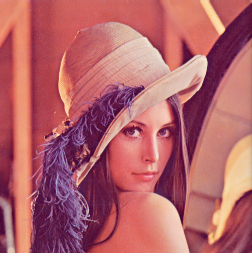
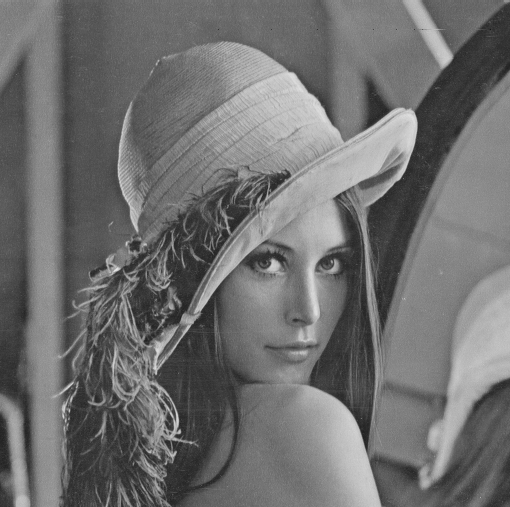
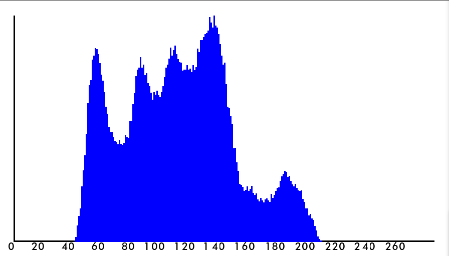
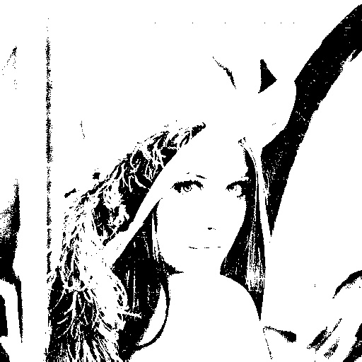
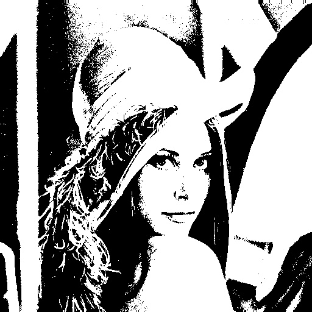
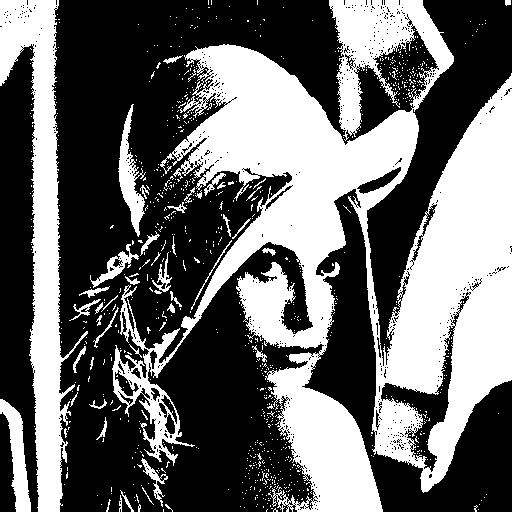
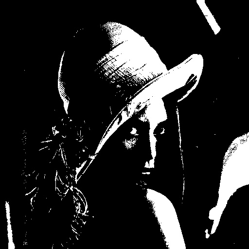

# this is a image lib..based on OPENCV

-------------------------

-------------------------

-------------------------

-------------------------

-------------------------

-------------------------

-------------------------

